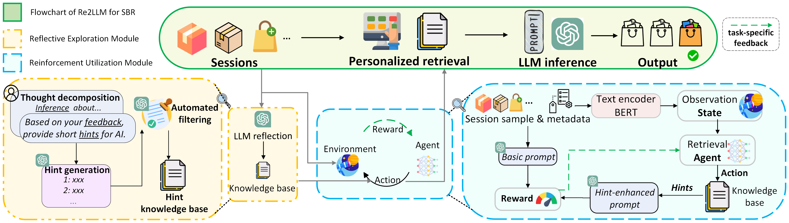

# Re2LLM
This is PyTorch implementation of our submission [Re2LLM: Reflective Reinforcement Large Language Model for
Session-based Recommendation].

## Architecture of Re2LLM


## Prerequisites
- Python >= 3.6
- PyTorch == 2.1.0
- transformers == 4.30.2
- numpy 1.24.4
- openai == 0.28.0
- gym == 0.21.0

## Training & Testing

### Training

- Set your own OpenAI API Key and backbone model before running the following command.

```
python PPO_discrete_main.py --savedir testmodel
```

### Testing

- To test the models saved as certain filename, and save the LLM output as certain filename, run the following command:

```
python test.py --testdir testmodel --output LLMoutput
```
